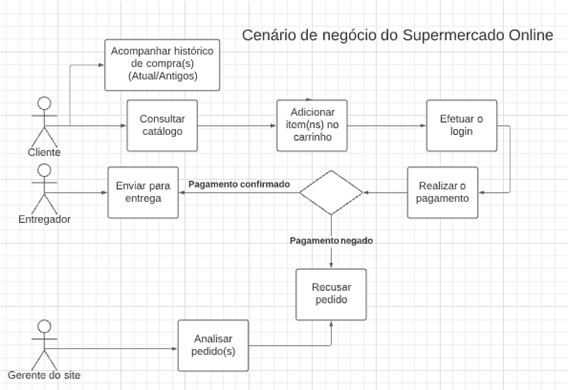
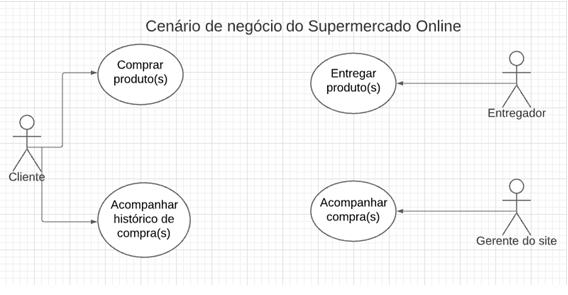
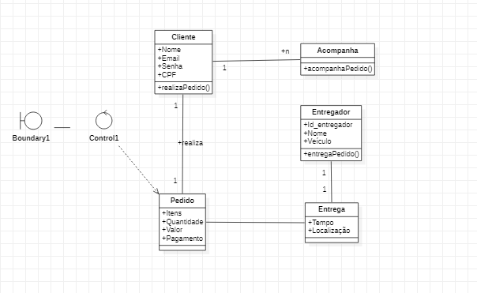

<h1>Definição do Tema do Projeto</h1>

Esquema de compra em um site de Supermercado Online, onde o  
cliente cadastrado acessa o catálogo de produtos do mercado,  
adiciona os produtosno carrinho, faz o pagamento, e  o  
Supermecado Online realiza a entregados produtos. 

<h1>Cenários de negócio</h1>

<h1>Diagrama de casos de uso</h1>

<h1>Diagrama de casos de domínio</h1>

